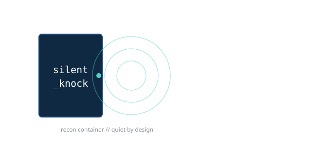
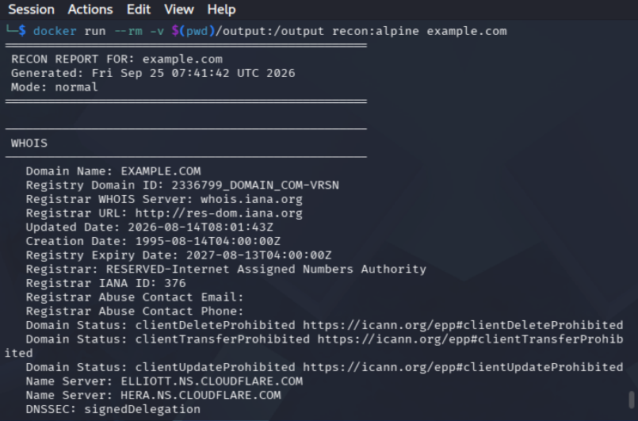
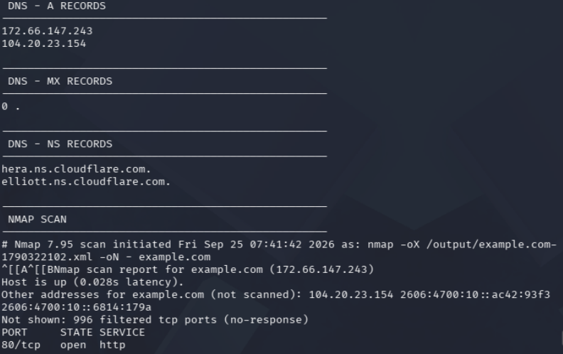
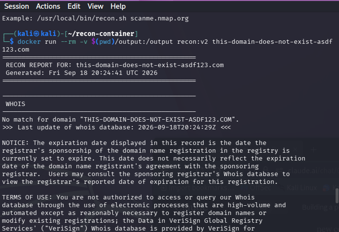
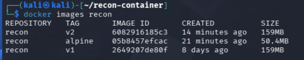
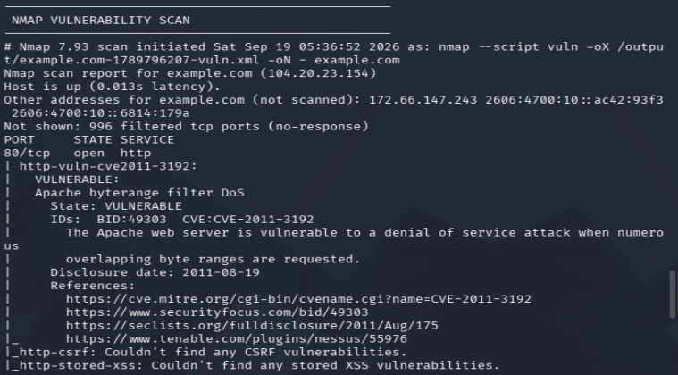
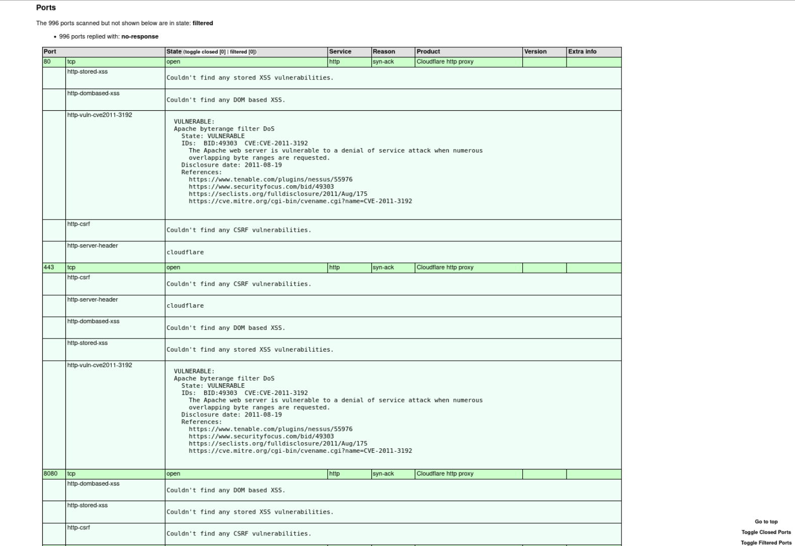

# Silent Knock

A containerized, multi-tool reconnaissance script — whois, DNS lookups, a standard nmap scan, and an nmap vulnerability scan — wrapped in a hardened, non-root Docker image, with a companion Python parser for the structured XML output.

Built as a hands-on Docker learning project: every tool call, every bug, and every fix below was worked through by hand rather than copy-pasted from a tutorial.

## What it does

Given a target (domain or IP), Silent Knock runs:

1. **whois** — domain registration lookup
2. **DNS** — A, MX, and NS record lookups via `dig`
3. **nmap** — a standard port scan, saved as both human-readable text and structured XML
4. **nmap vulnerability scan** (`--script vuln`, with `-sV` version detection) — checks discovered services against known CVE signatures, also saved as XML

All output is written to `/output` (bind-mounted to your host), timestamped so repeated scans never overwrite each other.





## Usage

```bash
docker build -t silentknock:v2 .
mkdir -p output
docker run --rm -v $(pwd)/output:/output silentknock:v2 <target>
```

Add `--slow` to run the vulnerability scan at a reduced rate (`-T2`, 1-second delay between probes) — useful for testing against your own infrastructure without tripping IDS/firewall alerting:

```bash
docker run --rm -v $(pwd)/output:/output silentknock:v2 <target> --slow
```

**Only scan targets you own or are explicitly authorized to test.** `scanme.nmap.org` and `testphp.vulnweb.com` are both sanctioned public targets for this kind of practice.

### Built-in usage guard

Running the container with no target — or a target that doesn't resolve — doesn't fail silently. The script prints its own usage message, and a bad/nonexistent domain still produces a clean, complete report (whois correctly reporting "no match," nmap correctly reporting nothing to scan) rather than crashing:



## Two builds, two footprints

| Image | Base | Size |
|---|---|---|
| `silentknock:v2` | `debian:bookworm-slim` | 159MB |
| `silentknock:alpine` | `alpine:3.20` | 50.4MB |

Same script, same functionality, same hardening — a ~68% size reduction from base image choice alone.



Build the Alpine version with:

```bash
docker build -t silentknock:alpine -f Dockerfile.alpine .
```

## Hardening

- **Non-root by default.** Both images create a dedicated system user (UID/GID `5000`, matched across both distros) and switch to it before the entrypoint runs — nothing executes as root inside the container.
- **Pinned nmap version (Alpine build).** `nmap=7.95-r0` is pinned explicitly rather than tracking "latest," for reproducible builds.
- **`--no-install-recommends` / `--no-cache`** on package installs to keep image layers lean, with cache cleanup folded into the same `RUN` line so it never gets baked into a permanent layer.

## Vulnerability scanning

The `--script vuln` pass runs NSE's vulnerability-detection scripts against every discovered service, with `-sV` version detection layered in so findings can be cross-referenced against the actual detected product/version — not just the port number.



**Note on the finding above:** this was investigated and confirmed as a false positive — the target is served through Cloudflare, not a raw Apache install, and the NSE script was keying off a response header that Cloudflare's edge also sends for unrelated, safe reasons. See "Debugging notes" below for how that was verified. It's kept here deliberately, as a reminder that automated scanner output always needs human verification before being treated as a real finding.

## Parsing the XML output

`parse_nmap.py` reads either XML report and prints a clean host/port/state/service summary, including TLS-tunnel detection and detected service product/version:

```bash
python3 parse_nmap.py output/<target>-<timestamp>-vuln.xml
```

Example output:
```
Host: 172.66.147.243
  Port 80: open (http — Cloudflare http proxy)
  Port 443: open (ssl/http — Cloudflare http proxy)
```

## Sorting output by target

`sort_output.sh` organizes `/output` into one subfolder per scanned target, matching `.txt` and `.xml` files by target name regardless of dots in the domain:

```bash
./sort_output.sh
```

## Debugging notes worth knowing about

A few real issues hit and fixed during development — documented here because they're the kind of thing worth recognizing quickly if you hit them elsewhere:

- **`whois` failing with a `getaddrinfo` / `ai_socktype` error** inside a minimal Debian container — caused by a missing `/etc/services` file. Fixed by installing the `netbase` package.
- **False-positive CVE detection.** `--script vuln` flagged both images with `CVE-2011-3192` (an old Apache DoS) against a Cloudflare-fronted target. Confirmed as a false positive two independent ways: `curl -I` showing `server: cloudflare` (not Apache), and `-sV`'s own `product="Cloudflare http proxy"` field. The NSE script was keying off the presence of an `Accept-Ranges` header alone, which modern CDN edges also send for unrelated, safe reasons.
- **Mismatched UIDs across a bind mount.** Debian's `useradd` and Alpine's `useradd` each auto-assign different UIDs by default, and a bind-mounted host folder doesn't remap ownership — meaning a non-root container user can get silently locked out of a folder it should be able to write to. Fixed by explicitly pinning the UID/GID (`-u`/`-g`) to the same number in both Dockerfiles, and `chown`-ing the host folder to match.
- **A stuck container, confirmed via exit code.** A hung scan left a container running indefinitely; `docker stop` on it later showed exit code `137` (SIGKILL) rather than `0`, confirming it had to be force-killed rather than exiting on its own.
- **Same UID lesson, showing up on the host this time.** After `chown -R 5000:5000 output/` to fix container write access, `xsltproc` (run directly on the host, not in a container) started failing with exit code `11` and no visible error — turned out the host user isn't UID `5000` or in that group, so it had read access but not write access to `output/`. Fixed with `chmod -R o+w output/`. Same underlying lesson as the container UID mismatch above: ownership mismatches fail quietly, and the fix is almost always either matching the UID or opening up the permission bit that's actually missing.

## Viewing a report as HTML

`view_last.sh` finds the most recent vuln scan for a target, converts it to a styled HTML report using nmap's own built-in XSL stylesheet, and opens it in your browser — no manual filename hunting required.

```bash
sudo apt install xsltproc   # one-time, host-side
./view_last.sh example.com
```



## Files

| File | Purpose |
|---|---|
| `silentknock.sh` | Main recon script (runs inside the container) |
| `Dockerfile` | Debian-based build |
| `Dockerfile.alpine` | Alpine-based build (smaller footprint) |
| `parse_nmap.py` | Standalone XML report parser |
| `sort_output.sh` | Organizes `/output` into per-target subfolders |
| `view_last.sh` | Converts the latest vuln scan to HTML and opens it |
| `logo.svg` | Project logo |

## Possible next steps

- Sequential-vs-parallel scan timing (whois/DNS/nmap currently run one after another)
- Extending `parse_nmap.py` to summarize vuln findings directly rather than just port/service data